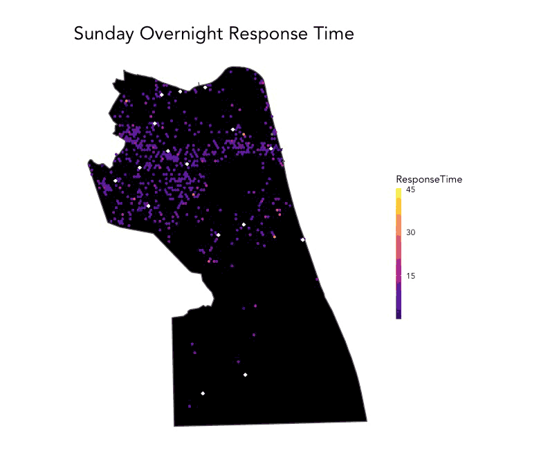

# 1. Introduction

```{r setup, include=FALSE, echo=FALSE}
knitr::opts_chunk$set(echo = TRUE)

#load libraries
library(tidyverse)
library(tidycensus)
library(dplyr)
library(sf)
library(mapview)
library(viridis) 
library(riem)
library(lubridate)
library(gridExtra)
library(leaflet)
library(shiny)
library(mapboxapi)
library(riem)
library(measurements)
library(mapboxapi)
library(FNN)
library(kableExtra)
library(ggcorrplot)
library(papeR)
```

```{r theme and functions, echo=FALSE}
#themes and nn_function
# Set up plot and map themes
plotTheme <- theme(text = element_text( family = "Avenir", color = "black"),
                   plot.title =element_text(size=13, face = "bold"),
                   plot.subtitle = element_text(size=8),
                   plot.caption = element_text(size = 6),
                   axis.text.x = element_text(size = 8, angle = 45, hjust = 1),
                   axis.title.x = element_text(size = 10),
                   axis.text.y = element_text(size = 8),
                   axis.title.y = element_text(size = 10),
                   # Set the entire chart region to blank
                   panel.background=element_blank(),
                   plot.background=element_blank(),
                   #panel.border=element_rect(colour="#F0F0F0"),
                   # Format the grid
                   panel.grid.major=element_line(colour="#565050",size=.2),
                   axis.ticks=element_blank())

gridTheme <- theme(text = element_text( family = "Avenir", color = "black"),
                   plot.title =element_text(size=7, face = "bold"),
                   plot.subtitle = element_text(size=5),
                   plot.caption = element_text(size = 5),
                   axis.text.x = element_text(size = 6),
                   axis.title.x = element_text(size = 6),
                   axis.text.y = element_text(size = 6),
                   axis.title.y = element_text(size = 6),
                   # Set the entire chart region to blank
                   panel.background=element_blank(),
                   plot.background=element_blank(),
                   #panel.border=element_rect(colour="#F0F0F0"),
                   # Format the grid
                   panel.grid.major=element_line(colour="#565050",size=.2),
                   axis.ticks=element_blank())

mapTheme <- theme(text = element_text( family = "Avenir", color = "black"),
                  plot.title =element_text(size=13),
                  plot.subtitle = element_text(size=7),
                  plot.caption = element_text(size = 5),
                  axis.line=element_blank(),
                  axis.text.x=element_blank(),
                  axis.text.y=element_blank(),
                  axis.ticks=element_blank(),
                  axis.title.x=element_blank(),
                  axis.title.y=element_blank(),
                  panel.background=element_blank(),
                  panel.border=element_blank(),
                  panel.grid.major=element_line(colour = 'transparent'),
                  panel.grid.minor=element_blank(),
                  legend.direction = "vertical", 
                  legend.position = "right",
                  plot.margin = margin(1, 1, 1, 1, 'cm'),
                  legend.key.height = unit(1, "cm"), legend.key.width = unit(0.2, "cm"))

qBr <- function(df, variable, rnd) {
  if (missing(rnd)) {
    as.character(quantile(round(df[[variable]],0),
                          c(.01,.2,.4,.6,.8), na.rm=T))
  } else if (rnd == FALSE | rnd == F) {
    as.character(formatC(quantile(df[[variable]]), digits = 3),
                 c(.01,.2,.4,.6,.8), na.rm=T)
  }
}


q5 <- function(variable) {as.factor(ntile(variable, 5))}

nn_function <- function(measureFrom,measureTo,k) {
  measureFrom_Matrix <-
    as.matrix(measureFrom)
  measureTo_Matrix <-
    as.matrix(measureTo)
  nn <-   
    get.knnx(measureTo_Matrix, measureFrom_Matrix, k)$nn.dist
  output <-
    as.data.frame(nn) %>%
    rownames_to_column(var = "thisPoint") %>%
    gather(points, point_distance, V1:ncol(.)) %>%
    arrange(as.numeric(thisPoint)) %>%
    group_by(thisPoint) %>%
    summarize(pointDistance = mean(point_distance)) %>%
    arrange(as.numeric(thisPoint)) %>% 
    dplyr::select(-thisPoint) %>%
    pull()
  
  return(output)  
}

# load color palettes
palette5 <- c("#03254c","#1167b1","#64b5f6","#2196f3","#bbdefb")
palette4 <- c("#3a7d7c","#ffa137","#ff4400","#065125")
palette2 <- c("#03254c","#187bcd")
palette1 <- c("#03254c")

my_token <- "pk.eyJ1IjoiZ2F1bHQzNCIsImEiOiJja2ZsbWd5cm8xNDBsMnlwajMzbW15c2Y0In0.nZ9siGKFAjMx_JQVEzeOtg"
```


# 2. Data

```{r, message=FALSE, warning=FALSE}
datasource_table <-data.frame(
  Datasets = c("Virginia Beach EMS calls data", "Tract level U.S. Census demographic data", "Weather data", "Tract level chronic disease and health outcome data"),
  Source = c("Provided by class", "U.S. Census Bureau", "Riem package which gather weather data from \n Automated Surface Observing System (ASOS) stations (airports)", "Center for Disease Control and Prevention")
)

kbl(datasource_table, caption ="<b>Datasets used<b>") %>%
  kable_paper(c("hover", "condensed"), full_width = T, html_font = "Avenir") %>%
  kable_styling (bootstrap_options = "striped", "condensed", font_size = 10) %>%
  row_spec(0, bold = T, color = "white", background = "#2e4057", font_size = 14) %>%
  column_spec(1, bold = T)
```

Our main dataset was provided by the class, which has the time and other characteristics of the EMS calls in Virginia Beach during January 2017 through February 2018. In the following section, we will discuss further about the feature engineering process using the data from this dataset. Additionally, we have used **tract level U.S. Census demographic data** from the U.S. Census Bureau, **weather data at the time of the calls** using the `reim` package, and **tract level chronic disease and health outcome data** from the Center for Disease Control and Prevention. We have selected these datasets to better understand the what factors may contribute to the **response time** of an EMS call. 

### 2.1. Load main EMS data
```{r, load the main dataset, message=FALSE, warning=FALSE, results='hide'}
# load main dataset and make it an SF object
main_ems <- read.csv("Main_VaBeach_EMS_2017_18.csv")
main_ems.sf <- main_ems %>%
  na.omit() %>%
  st_as_sf(coords = c("X", "Y"), crs = 4326, agr = "constant") %>%
  st_transform('EPSG:6595')
```

The main EMS dataset (`main_ems.sf`) includes a various temporal and other characteristics of the individual EMS calls. Using the temporal features in the dataset, we have engineered the following list of features including `ResponseTime`, our main feature we hope to be able to predict. We have engineered these features to find any factors that may be helpful in predicting the `ResponesTime` of the EMS calls. We have also created `CallVolume` feature, which aggregates the number of calls during the 3 hour periods where the individual calls falls under. For example, `CallVolume` value for an EMS call at **2pm on January 21, 2017**, will be the total number of EMS calls during **the period of 12pm to 3pm on January 21, 2017**. 

```{r, time feature table, results='asis'}
timefeatures_table <-data.frame(
  Features = c("ResponseTime", "time_of_day", "times", "dotw", "weekend", "CallVolume", "season", "holiday"),
  Description = c("Time from the initial call to EMS arriving at scene", "6 hour periods of a day (Overnight, Morning, Afternoon, Evening)", "3 hour periods of a day (one-three, three-six, six-nine, nine-twelve, twelve-fifteen, fifteen-eighteen, eighteen-twentyone,twentyone-twentyfour)", "Day of the week", "weekend", "Number of calls during the 3 hour period", "Spring, Summer, Fall, or Winter", "Includes major holidays - New Years Day, Martin Luther King Jr. Day, Memorial Day, Independence Day, Labor Day, Thanksgiving Day, and Christmas Day"),
  Type = c("Continous","Categorical", "Categorical", "Categorical", "Binary", "Continous", "Binary", "Binary")
)

kbl(timefeatures_table, caption ="<b>Engineered temporal features<b>") %>%
  kable_paper(c("hover", "condensed"), full_width = T, html_font = "Avenir") %>%
  kable_styling (bootstrap_options = "striped", "condensed", font_size = 10) %>%
  row_spec(0, bold = T, color = "white", background = "#2e4057", font_size = 14) %>%
  column_spec(1, bold = T)
```

```{r, feature engineer time vars}
# create time bins (30 min and 60 min)
# create days and weeks
# create ResponseTime from "CallDateandTime" to "OnSceneDateandTime" 
# create "time_of_day" (6 hour periods)
# create "times" (3 hour periods)
main_ems.sf <- main_ems.sf %>%
  mutate(interval60 = floor_date(mdy_hm(CallDateandTime), unit = "60 mins"),
         interval30 = floor_date(mdy_hm(CallDateandTime), unit = "30 mins"),
         week = week(interval60),
         dotw = as.character(wday(interval60, label=TRUE))) %>%
  mutate(ResponseTime =  as.numeric(difftime(mdy_hm(OnSceneDateandTime), mdy_hm(CallDateandTime), units = "min"))) %>%
  mutate(time_of_day = case_when(hour(interval60) >= 0 & hour(interval60) < 6 ~ "Overnight",
                                 hour(interval60) >= 6 & hour(interval60) < 12 ~ "Morning",
                                 hour(interval60) >= 12 & hour(interval60) < 18 ~ "Afternoon",
                                 hour(interval60) >= 18 & hour(interval60) <= 24 ~ "Evening")) %>%
  mutate(times = case_when(hour(interval60) >= 0 & hour(interval60) < 3 ~ "one-three",
                           hour(interval60) >= 3 & hour(interval60) < 6 ~ "three-six",
                           hour(interval60) >= 6 & hour(interval60) < 9 ~ "six-nine",
                           hour(interval60) >= 9 & hour(interval60) < 12 ~ "nine-twelve",
                           hour(interval60) >= 12 & hour(interval60) < 15 ~ "twelve-fifteen",
                           hour(interval60) >= 15 & hour(interval60) < 18 ~ "fifteen-eighteen",
                           hour(interval60) >= 18 & hour(interval60) < 21 ~ "eighteen-twentyone",
                           hour(interval60) >= 21 & hour(interval60) <= 24 ~ "twentyone-twentyfour")) %>%
  mutate(weekend = ifelse(dotw %in% c("Sun", "Sat"), "Weekend", "Weekday")) %>%
  mutate(season = case_when(week >= 1 & week < 10 ~ "Winter",
                            week >= 10 & week < 23 ~ "Spring",
                            week >= 23 & week < 40 ~ "Summer",
                            week >= 40 & week < 47 ~ "Fall", 
                            week >= 47 & week <= 52 ~ "Winter")) %>%
  mutate(Date = substring(CallDateandTime,1,7)) %>%
  unite(Date_timeofday, c(Date, time_of_day), sep = " ", remove = FALSE) %>%
  unite(Date_time, c(Date, times), sep = " ", remove = FALSE) %>%
  mutate(holiday = ifelse(Date %in% c("1/2/17 ", "1/16/17", "5/29/17", "7/4/17 ", "9/4/17 ", "11/23/1", "12/25/1", "1/1/18 ", "1/15/18"), "Holiday", "Non-Holiday")) %>%
  drop_na()

```

```{r, call volume, message=FALSE, warning=FALSE}
# create call volume column
vol_count_dat <- main_ems.sf %>%
  st_drop_geometry() %>%
  group_by(Date, times) %>%
  count(CallVolume = n()) %>%
  unite(Date_time, c(Date, times), sep = " ", remove = FALSE)

# join the volume data file to main dataframe
main_ems.sf <-
  left_join(main_ems.sf, vol_count_dat, by="Date_time")
```

Additionally, the `main_ems.sf` dataset includes a column with `RescueSquad.Number`. Each EMS calls are coded with the characteristics of the calls and the units that responded to the scene. We were able to contact one of the chiefs of the Virginia Beach EMS stations who was able to provide the description of these rescue squad codes. With that information, we have categorized the rescue squad types into a simpler categories, which you can see from the list below.

```{r, rescue squad feature table}
RescueSquad_table <-data.frame(
  Features = c("advanced_life_support", "chief_dispatch", "special_event", "air_dispatch", "hold_dispatch", "water_dispatch", "mass_casualty_dispatch", "fire_dispatch"),
  Description = c("Calls requiring advanced life support unit", "Calls requiring an EMS chief","Calls at a special event, like a concert or marathon", "Calls requiring Helicopter Ambulances", "Calls when the dispatcher was waiting on another ambulence", "Marine EMS Calls requiring rescue boat or jetski", "Calls requiring mass causalty unit", "Calls related to fire incidents"),
  Type = c("Binary","Binary", "Binary", "Binary", "Binary", "Binary", "Binary", "Binary")
)

kbl(RescueSquad_table , caption ="<b>Rescue squad types engineered features<b>") %>%
  kable_paper(c("hover", "condensed"), full_width = T, html_font = "Avenir") %>%
  kable_styling (bootstrap_options = "striped", "condensed", font_size = 10) %>%
  row_spec(0, bold = T, color = "white", background = "#2e4057", font_size = 14) %>%
  column_spec(1, bold = T)
```

```{r, rescue squad type}
main_ems.sf$advanced_life_support <- ifelse (
  (
    endsWith(main_ems.sf$RescueSquad.Number, 'S') |
      startsWith(main_ems.sf$RescueSquad.Number, 'Z') |
      endsWith(main_ems.sf$RescueSquad.Number, 'P') |
      startsWith(main_ems.sf$RescueSquad.Number, 'MED')
  ), 
  "Advanced Life Support", "Not Advanced Life Support"
)

main_ems.sf$b_advanced_life_support <- ifelse (
  (
    endsWith(main_ems.sf$RescueSquad.Number, 'S') |
      startsWith(main_ems.sf$RescueSquad.Number, 'Z') |
      endsWith(main_ems.sf$RescueSquad.Number, 'P') |
      startsWith(main_ems.sf$RescueSquad.Number, 'MED')
  ), 
  1, 0
)


main_ems.sf$chief_dispatch <- ifelse (
  (
    startsWith(main_ems.sf$RescueSquad.Number, 'ECH') |
      (((startsWith(main_ems.sf$RescueSquad.Number, 'CAR')) == TRUE) & ((startsWith(main_ems.sf$RescueSquad.Number, 'CART')) == FALSE)) |
      startsWith(main_ems.sf$RescueSquad.Number, 'BAT')
  ), 
  "Chief Dispatched", "Cheif not Dispatched"
)

main_ems.sf$b_chief_dispatch <- ifelse (
  (
    startsWith(main_ems.sf$RescueSquad.Number, 'ECH') |
      (((startsWith(main_ems.sf$RescueSquad.Number, 'CAR')) == TRUE) & ((startsWith(main_ems.sf$RescueSquad.Number, 'CART')) == FALSE)) |
      startsWith(main_ems.sf$RescueSquad.Number, 'BAT')
  ), 
  1, 0
)

main_ems.sf$special_event <- ifelse (
  (
    main_ems.sf$RescueSquad.Number == 'BKTEAM' |
      main_ems.sf$RescueSquad.Number == 'EMSOPS' |
      startsWith(main_ems.sf$RescueSquad.Number, 'CART')
  ), 
  "Special Event", "Not Special Event"
)

main_ems.sf$b_special_event <- ifelse (
  (
    main_ems.sf$RescueSquad.Number == 'BKTEAM' |
      main_ems.sf$RescueSquad.Number == 'EMSOPS' |
      startsWith(main_ems.sf$RescueSquad.Number, 'CART')
  ), 
  1, 0
)


main_ems.sf$air_dispatch <- ifelse (
  (
    main_ems.sf$RescueSquad.Number == 'AIRMED'
  ), 
  "Air unit", "Not an Air Unit"
)

main_ems.sf$b_air_dispatch <- ifelse (
  (
    main_ems.sf$RescueSquad.Number == 'AIRMED'
  ), 
  1, 0
)

main_ems.sf$hold_dispatch <- ifelse (
  (
    startsWith(main_ems.sf$RescueSquad.Number, 'HOLD')
  ), 
  "Held By Dispatcher", "Not Held by Dispatcher"
)

main_ems.sf$b_hold_dispatch <- ifelse (
  (
    startsWith(main_ems.sf$RescueSquad.Number, 'HOLD')
  ), 
  1, 0
)


main_ems.sf$water_dispatch <- ifelse (
  (
    startsWith(main_ems.sf$RescueSquad.Number, 'FBOA') |
      startsWith(main_ems.sf$RescueSquad.Number, 'RB') |
      startsWith(main_ems.sf$RescueSquad.Number, 'MRTK') |
      startsWith(main_ems.sf$RescueSquad.Number, 'JTSKI')
    
  ), 
  "Water Unit", "Not a Water Unit"
)

main_ems.sf$b_water_dispatch <- ifelse (
  (
    startsWith(main_ems.sf$RescueSquad.Number, 'FBOA') |
      startsWith(main_ems.sf$RescueSquad.Number, 'RB') |
      startsWith(main_ems.sf$RescueSquad.Number, 'MRTK') |
      startsWith(main_ems.sf$RescueSquad.Number, 'JTSKI')
    
  ), 
  1, 0
)


main_ems.sf$mass_casualty_dispatch <- ifelse (
  (
    startsWith(main_ems.sf$RescueSquad.Number, 'MCI') 
  ), 
  "Mass Casualty Incident", "Not a Mass Casualty Incident"
)

main_ems.sf$b_mass_casualty_dispatch <- ifelse (
  (
    startsWith(main_ems.sf$RescueSquad.Number, 'MCI') 
  ), 
  1, 0
)


main_ems.sf$fire_dispatch <- ifelse (
  (
    startsWith(main_ems.sf$RescueSquad.Number, 'L') |
      (startsWith(main_ems.sf$RescueSquad.Number, 'E') & ((startsWith(main_ems.sf$RescueSquad.Number, 'ECH') == FALSE) & (main_ems.sf$RescueSquad.Number != 'EMSOPS'))) |
      (startsWith(main_ems.sf$RescueSquad.Number, 'T') & (startsWith(main_ems.sf$RescueSquad.Number, 'TAC') == FALSE)) |
      endsWith(main_ems.sf$RescueSquad.Number, 'F') |
      startsWith(main_ems.sf$RescueSquad.Number, 'NE')
  ), 
  "Fire Team Dispactched", "Fire Team not Dispatched"
)

main_ems.sf$b_fire_dispatch <- ifelse (
  (
    startsWith(main_ems.sf$RescueSquad.Number, 'L') |
      (startsWith(main_ems.sf$RescueSquad.Number, 'E') & ((startsWith(main_ems.sf$RescueSquad.Number, 'ECH') == FALSE) & (main_ems.sf$RescueSquad.Number != 'EMSOPS'))) |
      (startsWith(main_ems.sf$RescueSquad.Number, 'T') & (startsWith(main_ems.sf$RescueSquad.Number, 'TAC') == FALSE)) |
      endsWith(main_ems.sf$RescueSquad.Number, 'F') |
      startsWith(main_ems.sf$RescueSquad.Number, 'NE')
  ), 
  1, 0
)

```

### 2.2 Load spatial features

We were also interested in the spatial features of the EMS calls. Using the locations of all **EMS stations**, **fire stations**, and **hospitals** in Virginia Beach, we have calculated the distance of the nearest locations of the three locations types through `nn_function`. Using this engineered feature, we will explore whether the distance to **EMS stations**, **fire stations**, or **hospitals** contribute to the `ResponseTime` of each calls.

```{r}
nn_table <-data.frame(
  Features = c("nn_ems_station", "nn_fire_stations", "nn_hospitals"),
  Description = c("distance to nearest EMS station", "distance to nearest fire station", "distance to nearest hosptial"),
  Type = c("Continuous","Continuous", "Continuous")
)

kbl(nn_table , caption ="<b>Eengineered spatial features<b>") %>%
  kable_paper(c("hover", "condensed"), full_width = T, html_font = "Avenir") %>%
  kable_styling (bootstrap_options = "striped", "condensed", font_size = 10) %>%
  row_spec(0, bold = T, color = "white", background = "#2e4057", font_size = 14) %>%
  column_spec(1, bold = T)
```

```{r, loading map files, message=FALSE, warning=FALSE}
# load VB boundary census tracts
vb_boundary <-
  st_read("https://gismaps.vbgov.com/arcgis/rest/services/Basemaps/Administrative_Boundaries/MapServer/0/query?where=1%3D1&outFields=*&outSR=4326&f=json") %>%
  st_transform('EPSG:6595')

# load VB tracts
vb_tracts <- 
  st_read("https://opendata.arcgis.com/datasets/82ada480c5344220b2788154955ce5f0_2.geojson") %>%
  subset(OBJECTID!= 22) %>%
  st_transform('EPSG:6595')

# create fishnet
vb_fishnet <- 
  st_make_grid(vb_boundary,
               cellsize = 1000, 
               square = FALSE) %>%
  .[vb_boundary] %>% 
  st_sf() %>%
  mutate(uniqueID = rownames(.))

#load ems stations hospitals and fire stations
ems_stations <- st_read('201127_ems_geocoded.shp') %>%
  st_transform(st_crs(vb_fishnet)) %>%
  mutate(OBJECTID = osm_id) %>%
  mutate(Legend = "ems_stations")

hospitals <- st_read('Hospitals__Virginia_.shp') %>% 
  dplyr::filter(City == 'Virginia Beach') %>%
  st_transform(st_crs(vb_fishnet)) %>%
  mutate(Legend = "hospitals")

fire_stations <- st_read('Fire_Stations.shp') %>% 
  dplyr::filter(CITY == 'Virginia Beach') %>%
  st_transform(st_crs(vb_fishnet)) %>%
  mutate(Legend = "fire_stations")

# create nn features
main_ems.sf <- main_ems.sf %>%
  mutate(ems_station_nn = nn_function(st_coordinates(main_ems.sf), st_coordinates(ems_stations), 1),
         hospitals_nn = nn_function(st_coordinates(main_ems.sf), st_coordinates(hospitals), 1),
         fire_stations_nn = nn_function(st_coordinates(main_ems.sf), st_coordinates(fire_stations), 1))
```

Using the **EMS station** locations, we also created a **voronoi map** using the following function. Assuming the assignment of call dispatches depend on the closest EMS stations, the voronoi map of Virginia would allow us to understand if there are specific "**EMS station zones**" that are seeing either longer or shorter EMS response time. 

```{r, warning=FALSE, message=FALSE}
# create voronoi
bbox_polygon <- function(x) {
  bb <- sf::st_bbox(x)
  
  p <- matrix(
    c(bb["xmin"], bb["ymin"], 
      bb["xmin"], bb["ymax"],
      bb["xmax"], bb["ymax"], 
      bb["xmax"], bb["ymin"], 
      bb["xmin"], bb["ymin"]),
    ncol = 2, byrow = T
  )
  
  sf::st_polygon(list(p))
}

box <- st_sfc(bbox_polygon(vb_boundary))

v <- st_voronoi(st_union(ems_stations), box)

voronoi_polygon <- (st_intersection(st_cast(v), st_union(vb_boundary))) %>%
  st_sf()

vb_voronoi <-st_join(voronoi_polygon,ems_stations, left =TRUE) %>%
  mutate(voronoi_id = OBJECTID) %>%
  dplyr::select(geometry, voronoi_id)

#Assign Voronoi ID for each EMS call
main_ems.sf <- st_join(main_ems.sf, vb_voronoi, left = TRUE)

ggplot() + 
  geom_sf(data = vb_voronoi, fill = "#1167b1") +
  geom_sf(data = ems_stations, color="white") +
  labs(title = "Virginia Beach EMS station zones \nusing voronoi function") +
  mapTheme
```

### 2.3 Load census and health data

We have also loaded U.S. Census data including the features that we may think may affect the `ResponseTime` of the EMS calls. Since we do not have the demographic information of the persons of the EMS calls, the tract level demographic information from the **U.S. Census American Community Survey(ACS)** is the closest we will get to understand the demographic information of the calls. In the later sections, we will we exploring the relationships with some of these variables and the call response time.

```{r}
census_vars_table <-data.frame(
  Features = c("Med_Age", "MedHHInc", "PopDens", "pctWhite", "pctBlack", "pctHis", "pctBachelors","pctPoverty", "pctCarCommute", "pctPubCommute"),
  Description = c("Median Age", "Median household income", "Population Density", "Percentage of White population", "Percentage of Black population", "Percentage of Hispanic populaiton", "Percentage of population with at least Bachelor's degree", "Percentage of population below the poverty line", "Percentage of population communiting by car", "Percentage of population commuting by public transit"),
  "Type" = c("continuous", "continuous", "continuous", "continuous", "continuous", "continuous", "continuous", "continuous", "continuous", "continuous"))

kbl(census_vars_table , caption ="<b> U.S. Census features<b>") %>%
  kable_paper(c("hover", "condensed"), full_width = T, html_font = "Avenir") %>%
  kable_styling (bootstrap_options = "striped", "condensed", font_size = 10) %>%
  row_spec(0, bold = T, color = "white", background = "#2e4057", font_size = 14) %>%
  column_spec(1, bold = T)
```

```{r,load census data, message=FALSE, warning=FALSE, results='hide'}
# Load census (pop_density, med_age, race, poverty, income, education, commute)
census_api_key("41e1c0d912341017fa6f36a5da061d3b23de335e", overwrite = TRUE)
selected_vars <- c("B01003_001E", # Total Population
                   "B02001_001E", # Estimate!!Total population by race -- ##let's double check that it's okay to use this as long as we justify it
                   "B02001_002E", # People describing themselves as "white alone"
                   "B02001_003E", # People describing themselves as "black" or "african-american" alone
                   "B15001_050E", # Females with bachelors degrees
                   "B15001_009E", # Males with bachelors degrees
                   "B19013_001E", # Median HH income
                   "B25058_001E", # Median rent
                   "B06012_002E", # Total poverty
                   "B08301_001E", # People who have means of transportation to work
                   "B08301_002E", # Total people who commute by car, truck, or van
                   "B08301_010E", # Total people who commute by public transportation"
                   "B03002_012E", # Estimate Total Hispanic or Latino by race
                   "B19326_001E", # Median income in past 12 months (inflation-adjusted)
                   "B07013_001E", # Total households
                   "B08013_001E", # Travel Time to Work
                   "B01002_001E") # Median Age

vb_census <- 
  get_acs(geography = "tract", 
          variables = selected_vars, 
          year=2018, 
          state="VA",
          county = c("Virginia Beach"),
          geometry=T, 
          output="wide") %>%
  st_transform('EPSG:6595') %>%
  rename(TotalPop = B01003_001E,
         Med_Age = B01002_001E,
         Race_TotalPop = B02001_001E, 
         Whites = B02001_002E,
         Blacks = B02001_003E,
         FemaleBachelors = B15001_050E, 
         MaleBachelors = B15001_009E,
         MedHHInc = B19013_001E,
         TotalPoverty = B06012_002E,
         TotalCommute = B08301_001E,
         CarCommute = B08301_002E,
         PubCommute = B08301_010E,
         TotalHispanic = B03002_012E,
         MedInc = B19326_001E,
         TotalHH = B07013_001E)
vb_census <- vb_census %>%
  dplyr::select(-NAME, -starts_with("B0"), -starts_with("B1"), -starts_with("B2")) %>%
  mutate(Area = st_area(vb_census),
         pctWhite = (ifelse(Race_TotalPop > 0, Whites / Race_TotalPop,0))*100,
         pctBlack = (ifelse(Race_TotalPop > 0, Blacks / Race_TotalPop,0))*100,
         pctHis = (ifelse(Race_TotalPop >0, TotalHispanic/Race_TotalPop,0))*100,
         pctBachelors = (ifelse(Race_TotalPop > 0, ((FemaleBachelors + MaleBachelors) / Race_TotalPop),0)) *100,
         pctPoverty = (ifelse(Race_TotalPop > 0, TotalPoverty / Race_TotalPop, 0))*100,
         pctCarCommute = (ifelse(TotalCommute > 0, CarCommute / TotalCommute,0))*100,
         pctPubCommute = (ifelse(TotalCommute > 0, PubCommute / TotalCommute,0))*100,
         year = "2018") %>%
  mutate(MedHHInc = replace_na(MedHHInc, 0),
         pctBachelors= replace_na(pctBachelors,0),
         pctHis= replace_na(pctHis,0),
         pctCarCommute= replace_na(pctCarCommute,0),
         PopDens = (TotalPop/(Area/27878400))) %>%
  dplyr::select(-Whites, -Blacks, -FemaleBachelors, -MaleBachelors, -TotalPoverty, -CarCommute, -PubCommute, -TotalCommute, -TotalHispanic)
```

Additionally, we also included the chronic disease and health outcome data from the **Center for Disease Control and Prevention (CDC)**. This dataset is a census tract-level estimates for chronic disease risk factors and health outcomes, including **cancer, diabetes, obesity, stroke, arthritis, asthma, chronic kidney diseases, etc**. Similar to the census demographic data, the limitation of this data set is that the data is on the tract level. However, without the individual characteristics of the EMS calls, this dataset at least allows us to analyze **whether if there is chronic diseases and health outcomes impact the response time of the EMS calls in Virginia Beach**. 

```{r, load helth data}
health_dat <- read.csv('health_data_500_cities_vabch.csv') %>% 
  dplyr::select(TractFIPS, ends_with('CrudePrev')) %>% 
  rename(GEOID = TractFIPS)
```

```{r, merging to main daraframe}
vb_health <- merge(health_dat, vb_census,
                   by.x = "GEOID", by.y = "GEOID",
                   all.x = FALSE, all.y = TRUE,
                   sort = FALSE) %>% 
  dplyr::select(GEOID, ends_with('CrudePrev'), geometry) %>% 
  st_sf()


main_ems.sf <-st_join(main_ems.sf,vb_census, left =TRUE) %>%
  mutate(TotalPop = TotalPop,
         MedHHInc = MedHHInc,
         TotalHH = TotalHH,
         pctWhite = pctWhite,
         pctBlack = pctWhite,
         pctHis= pctHis,
         pctBachelors= pctBachelors,
         pctPoverty = pctPoverty,
         pctCarCommute= pctCarCommute,
         pctPubCommute= pctPubCommute,
         PopDens= PopDens)

#you can find variable names here: https://www.cdc.gov/places/about/500-cities-2016-2019/index.html
main_ems.sf <-st_join(main_ems.sf,vb_health, left =TRUE) %>%
  mutate(
    ACCESS2_CrudePrev = ACCESS2_CrudePrev,
    ARTHRITIS_CrudePrev = ARTHRITIS_CrudePrev,
    BINGE_CrudePrev = BINGE_CrudePrev,
    BPHIGH_CrudePrev = BPHIGH_CrudePrev,
    BPMED_CrudePrev = BPMED_CrudePrev,
    CANCER_CrudePrev = CANCER_CrudePrev,
    CASTHMA_CrudePrev = CASTHMA_CrudePrev,
    CHD_CrudePrev = CHD_CrudePrev,
    CHECKUP_CrudePrev = CHECKUP_CrudePrev,
    CHOLSCREEN_CrudePrev = CHOLSCREEN_CrudePrev,
    COLON_SCREEN_CrudePrev = COLON_SCREEN_CrudePrev,
    COPD_CrudePrev = COPD_CrudePrev,
    COREM_CrudePrev = COREM_CrudePrev,
    COREW_CrudePrev = COREW_CrudePrev,
    CSMOKING_CrudePrev = CSMOKING_CrudePrev,
    DENTAL_CrudePrev = DENTAL_CrudePrev,
    DIABETES_CrudePrev = DIABETES_CrudePrev,
    HIGHCHOL_CrudePrev = HIGHCHOL_CrudePrev,
    KIDNEY_CrudePrev = KIDNEY_CrudePrev,
    LPA_CrudePrev = LPA_CrudePrev,
    MAMMOUSE_CrudePrev = MAMMOUSE_CrudePrev,
    MHLTH_CrudePrev = MHLTH_CrudePrev,
    OBESITY_CrudePrev = OBESITY_CrudePrev,
    PAPTEST_CrudePrev = PAPTEST_CrudePrev,
    PHLTH_CrudePrev = PHLTH_CrudePrev,
    SLEEP_CrudePrev = SLEEP_CrudePrev,
    STROKE_CrudePrev = STROKE_CrudePrev,
    TEETHLOST_CrudePrev = TEETHLOST_CrudePrev
  )
```


### 2.4 Load weather data

Using the `reim` package, we also included the hourly weather data. Hourly **Temperature, Precipitation, Wind Speed, and Humidity** data in Virginia Beach were matched to EMS calls. We have also created three additional binary features **SnowPresent, HeavyRain, and StrongWind** to see if this will make the significance of the relationship with call response time better. **SnowPresent** feature was created by filtering hours when the **temperature was below 42F and Precipitation is above 0**. **HeavyRain** feature was created by filtering hours when the **Precipitation was above 0.5 inches**. **StrongWind** feature was created by filtering hours when the **the average hourly Wind_Speed was above 30mph**.

```{r, load weather data, message=FALSE, warning=FALSE, results='hide'}
# Load weather data and create features
vb_weather <- 
  riem_measures(station = "NTU", date_start = "2017-01-01", date_end = "2018-03-01") %>%
  dplyr::select(valid, tmpf, p01i, sknt, relh)%>%
  replace(is.na(.), 0) %>%
  mutate(interval60 = ymd_h(substr(valid,1,13))) %>%
  mutate(week = week(interval60),
         dotw = wday(interval60, label=TRUE)) %>%
  group_by(interval60) %>%
  summarize(Temperature = max(tmpf),
            Precipitation = sum(p01i),
            Wind_Speed = max(sknt),
            Humidity = max(relh)) %>%
  mutate(Temperature = ifelse(Temperature == 0, 42, Temperature)) %>%
  mutate(SnowPresent = ifelse(Precipitation > 0.0 & Temperature < 32.0, "Snow", "NoSnow"),
         HeavyRain = ifelse(Precipitation > 0.5, "HeavyRain", "NoHeavyRain"),
         StrongWind = ifelse(Wind_Speed > 30, "StrongWind","NoStrongWind"))

# join weather data to the main dataframe
main_ems.sf <-
  left_join(main_ems.sf, vb_weather, by="interval60")

##GET RID OF NAs
main_ems.sf <- main_ems.sf %>%
  drop_na()
```

# 3. Exploratory Analysis

Now that we have loaded all of the necessary datasets, we will be visualizing the selected features' relationship with the EMS call response time. In our analyses, we will be looking at both spatial and temporal relationships. 

### 3.1 Spatial distribution of EMS calls

First, we wanted to understand where the EMS calls are coming from. We created the fishnet of from the Virginia Beach boundary shapefile and aggregated the EMS calls for each grid. The following map shows that areas in the northern part of the city sees the most EMS calls. Thsi distribution makes sense as most developments congregate around the nothern part of the city boundary. 

```{r}
# create fishnet
vb_fishnet <- 
  st_make_grid(vb_boundary,
               cellsize = 1000, 
               square = FALSE) %>%
  .[vb_boundary] %>% 
  st_sf() %>%
  mutate(uniqueID = rownames(.))

# create EMS calls on fishnet
vb_ems_fishnet <- 
  dplyr::select(main_ems.sf) %>%    
  mutate(countEMS = 1,
  ) %>%    
  aggregate(., vb_fishnet, sum) %>%    
  mutate(countEMS = replace_na(countEMS, 0),
         uniqueID = rownames(.),
         cvID = sample(round(nrow(vb_fishnet) / 24),          
                       size=nrow(vb_fishnet), replace = TRUE))

# map fishnet of EMS calls in VB
ggplot() +
  geom_sf(data = vb_ems_fishnet, aes(fill = countEMS), color = NA) +
  scale_fill_viridis() +
  labs(title = "Fishnet of EMS calls in Virginia Beach") +
  mapTheme
```

### 3.2 Response time of EMS calls

Now that we have a better sense of where the EMS calls are coming from, we wanted to better understand the `ResponseTime` of the EMS calls. The Histogram below shows that the most calls are under 20 minutes while there is a tail of some calls that are much longer. The yellow dotted line in the histogram represents the average of `ResponseTime` of all calls in the data set is **8.72** which can be translated to **8 minutes and 42 seconds**. 

```{r, warning=FALSE, message=FALSE}
# histogram of the ResponseTime
ggplot(main_ems.sf, aes(x=ResponseTime)) +
    geom_histogram(binwidth=1, fill = "darkblue") +
    xlim(0, 50) +
    labs(title="Histogram of all Response Time of EMS calls",
         x="ResponseTime", 
         y="Count") +
    geom_vline(xintercept = 8.72, linetype="dotted", 
                color = "orange", size=1.5) +
    plotTheme
# mapping all calls response time 
ResponseTime_net <- 
  main_ems.sf %>%
  dplyr::select(ResponseTime, dotw, time_of_day) %>%
  mutate(ResponseTime = as.numeric(ResponseTime)) %>% 
  dplyr::select(ResponseTime) %>%
  aggregate(., vb_fishnet, mean) %>%
  mutate(ResponseTime = replace_na(ResponseTime, 0))

```

Then, what does the `ResponseTime` across space? Using the same fishent, we have calculated the average response time of all calls within the fishnet grids. The lighter colors represent a higher average response time of all the calls within the fishnet grid. You can see from the map below that there are parts in the northern part of the city, where dead end streets along the rivers and bays experience a higher average response time. You can also see that some parts in the southern part of the city, which is more rural compared to the more developed northern part of the city, also experience a higher response time. This may be the result of the location of the calls being distant from from EMS stations (depicted in white dot). 

```{r, warning=FALSE, message=FALSE}
#map of response time
ggplot() + 
    geom_sf(data = vb_boundary, fill = "black") +
    geom_sf(data = ResponseTime_net %>%
              dplyr::filter(ResponseTime > 0), color = NA, aes(fill = ResponseTime)) +
    scale_fill_viridis_c(option="plasma") +
    geom_sf(data = ems_stations, color="white") +
    labs(title= "Response Time of EMS calls by fishnet") +
    mapTheme
```

How does response time differ by the EMS stations? Since we do not have th information of where the EMS dispatches are coming from, the best alternative is using the **EMS station voronoi map** we created earlier, assuming most EMS dispatches occur by the distance to the EMS station. The following map shows the average response time of the EMS calls byt he EMS station zones. This map allows us to see which EMS stations are resulting in longer response time.  

```{r, warning=FALSE, message=FALSE}
voronoi_ResponseTime <- 
  main_ems.sf %>%
  dplyr::select(ResponseTime) %>%
  mutate(ResponseTime = as.numeric(ResponseTime)) %>% 
  dplyr::select(ResponseTime) %>%
  aggregate(., vb_voronoi, mean) %>%
  mutate(ResponseTime = replace_na(ResponseTime, 0))


#map of response time
ggplot() + 
    geom_sf(data = voronoi_ResponseTime %>%
              dplyr::filter(ResponseTime > 0), color = NA, aes(fill = ResponseTime)) +
    scale_fill_viridis_c(option="plasma") +
    geom_sf(data = ems_stations, color="white") +
    labs(title= "Avg Response Time of EMS calls by EMS Station Zones") +
    mapTheme
```

### 3.3. Response Time by Call Volume

One of the factors that we initially thought would be impactful in determining response time of an EMS call was the **EMS call volume** at the time of the call. As described in the previous section `CallVolume` feature was created by aggregating the number of calls during the 3 hour periods where the individual calls falls under, which then were assigned to individual calls. For example, `CallVolume` value for an EMS call at **2pm on January 21, 2017**, will be the total number of EMS calls during **the period of 12pm to 3pm on January 21, 2017**. 

What we see from the scatterplot below is that `CallVolume` doesn't seem to be a strong determinant of the EMS call response time. We initially suspected that the more calls there are during the time a particular EMS call is called, the longer the response time would be. However, this shows that there are many other factors that may be influencing the the response time of the EMS calls. 

```{r, warning=FALSE, message=FALSE}
# plot call volume
ggplot(main_ems.sf, aes(x=CallVolume, y=ResponseTime)) +
  geom_point(size = .75, colour = "darkblue") +
  labs(title= "Average Response Time by Call Volume") +
  plotTheme
```

### 3.4 Temporal features

We've also explored the average `ResponseTime` across `dotw` which represents **days of the week** and `time_of_day` representing 6 hour time periods of a day (**Overnight, Morning, Afternoon, Evening**). The char below shows that on average, response times during **weekday afternoon** tend to have longer response time while **weekday evening** calls tend to have a shorter response time. On the other hand, **weekend afternoon** calls have shorter response time. The second chart shows the average response time by weekday and weekends. While the difference isn't not drastic, the weekday calls' reponse time tend to be longer. 

```{r, warning=FALSE, message=FALSE}
# map Response Time of EMS calls by days of the week and time of the day
ggplot(data = main_ems.sf %>%
         group_by(dotw, time_of_day) %>%
         summarise(meanResponeTime = mean(ResponseTime, na.rm=TRUE))) +
  geom_bar(aes(x=meanResponeTime, y=dotw, fill = time_of_day), stat="identity", position=position_dodge())+
  scale_fill_manual(values = palette5) +
  labs(title="Response Time of EMS calls by days of the week and time of the day",
       x="ResponseTime", 
       y="Day of the week")+
  plotTheme

ggplot(data = main_ems.sf %>%
           group_by(weekend) %>%
           drop_na(weekend) %>%
           summarise(meanResponeTime = mean(ResponseTime, na.rm=TRUE))) +
    geom_bar(aes(x=weekend, y=meanResponeTime, fill=weekend), stat="identity", position=position_dodge(), show.legend = FALSE, width=0.5) +
    scale_fill_manual(values = palette2) + 
    labs(title="Response Time of EMS calls by weekday or weekend",
       x="Weekday or weekend", 
       y="ResponseTime") +
    plotTheme
```

Additionally, we also wanted to explore the temporal characteristics of the EMS calls' response time in spatial context. The animated maps below shows the **response time by days of the week and time of the day**. 


We've also looked at the average response time which **season** the calls happened, and whether the calls were during major **holidays**, including New Years Day, Martin Luther King Jr. Day, Memorial Day, Independence Day, Labor Day, Thanksgiving Day, and Christmas Day. You can see that calls during **Winter** months tend to have a longer response time. Also, the second chart shows that calls during **holidays** tends to be shorter. 

```{r, warning=FALSE, message=FALSE}
grid.arrange(
  ggplot(data = main_ems.sf %>%
           group_by(season) %>%
           drop_na(season) %>%
           summarise(meanResponeTime = mean(ResponseTime, na.rm=TRUE))) +
    geom_bar(aes(x=season, y=meanResponeTime, fill=season), stat="identity", position=position_dodge(), show.legend = FALSE, width=0.5) +
    scale_fill_manual(values = palette5) + 
    gridTheme, 
    ggplot(data = main_ems.sf %>%
           group_by(holiday) %>%
           drop_na(holiday) %>%
           summarise(meanResponeTime = mean(ResponseTime, na.rm=TRUE))) +
    geom_bar(aes(x=holiday, y=meanResponeTime, fill=holiday), stat="identity", position=position_dodge(), show.legend = FALSE, width=0.5) +
    scale_fill_manual(values = palette2) + 
    gridTheme,
  ncol=2)
```

### 3.5 Call type characteristics 

We've also looked at the call type characteristics in the main dataset. **CallPriority** feature consist of three types:

* **Priority 1**: Critical
* **Priority 2**: Urgent
* **Priority 3**: Non-Urgent

Surprisingly, the **Priority 1** calls did not have the shortest response time. Non-urgent **Priority 3** calls had the shortest response time. 

```{r, warning=FALSE, message=FALSE}
# map meanResponseTime by CallPriority
ggplot(data = main_ems.sf %>%
         group_by(CallPriority) %>%
         summarise(meanResponeTime = mean(ResponseTime, na.rm=TRUE))) +
  geom_bar(aes(x=CallPriority, y=meanResponeTime, fill=CallPriority), stat="identity", position=position_dodge(), show.legend = FALSE, width=0.5) +
  labs(title= "Avg Response Time Difference of Call Prioriy Types") +
  plotTheme
```

The following sets of graphs show eight different rescue squad types. **EMS Calls requiring an EMS Chief** has significantly shorter response time, which is due to the fact that EMS chiefs are sent on special and critical cases. Calls with **Special Events, air units, water unit, mass casualty** and **fire team** rescue squads and significantly shorter response time. These features will be very helpful in our prediction model. 

```{r, warning=FALSE, message=FALSE}
grid.arrange(
  ggplot(data = main_ems.sf %>%
         group_by(advanced_life_support) %>%
         drop_na(advanced_life_support) %>%
         summarise(meanResponeTime = mean(ResponseTime, na.rm=TRUE))) +
  geom_bar(aes(x=advanced_life_support, y=meanResponeTime, fill=advanced_life_support), stat="identity", position=position_dodge(), show.legend = FALSE, width=0.5) +
  scale_fill_manual(values = palette2) + 
  labs(title= "Avg Response Time Difference of EMS Calls requiring Adv. Life Support") +
  gridTheme,
  
  ggplot(data = main_ems.sf %>%
         group_by(chief_dispatch) %>%
         drop_na(chief_dispatch) %>%
         summarise(meanResponeTime = mean(ResponseTime, na.rm=TRUE))) +
  geom_bar(aes(x=chief_dispatch, y=meanResponeTime, fill=chief_dispatch), stat="identity", position=position_dodge(), show.legend = FALSE, width=0.5) +
  scale_fill_manual(values = palette2) + 
  labs(title= "Avg Response Time Difference of EMS Calls needing a Chief") +
  gridTheme,
  
  ggplot(data = main_ems.sf %>%
         group_by(special_event) %>%
         drop_na(special_event) %>%
         summarise(meanResponeTime = mean(ResponseTime, na.rm=TRUE))) +
  geom_bar(aes(x=special_event, y=meanResponeTime, fill=special_event), stat="identity", position=position_dodge(), show.legend = FALSE, width=0.5) +
  scale_fill_manual(values = palette2) + 
  labs(title= "Avg Response Time Difference of EMS Calls at Special Events") +
  gridTheme,
  
  ggplot(data = main_ems.sf %>%
         group_by(air_dispatch) %>%
         drop_na(air_dispatch) %>%
         summarise(meanResponeTime = mean(ResponseTime, na.rm=TRUE))) +
  geom_bar(aes(x=air_dispatch, y=meanResponeTime, fill=air_dispatch), stat="identity", position=position_dodge(), show.legend = FALSE, width=0.5) +
  scale_fill_manual(values = palette2) + 
  labs(title= "Avg Response Time Difference of EMS Calls Using Helicopter Amb.") +
  gridTheme
)

grid.arrange(
  ggplot(data = main_ems.sf %>%
         group_by(hold_dispatch) %>%
         drop_na(hold_dispatch) %>%
         summarise(meanResponeTime = mean(ResponseTime, na.rm=TRUE))) +
  geom_bar(aes(x=hold_dispatch, y=meanResponeTime, fill=hold_dispatch), stat="identity", position=position_dodge(), show.legend = FALSE, width=0.5) +
  scale_fill_manual(values = palette2) +
  labs(title= "Avg Response Time Difference of EMS Calls on HOLD by Dispatcher") +
  gridTheme,
  
  ggplot(data = main_ems.sf %>%
         group_by(water_dispatch) %>%
         drop_na(water_dispatch) %>%
         summarise(meanResponeTime = mean(ResponseTime, na.rm=TRUE))) +
  geom_bar(aes(x=water_dispatch, y=meanResponeTime, fill=water_dispatch), stat="identity", position=position_dodge(), show.legend = FALSE, width=0.5) +
  scale_fill_manual(values = palette2) + 
  labs(title= "Avg Response Time Difference of Marine EMS Calls") +
  gridTheme,
  
  ggplot(data = main_ems.sf %>%
         group_by(mass_casualty_dispatch) %>%
         drop_na(mass_casualty_dispatch) %>%
         summarise(meanResponeTime = mean(ResponseTime, na.rm=TRUE))) +
  geom_bar(aes(x=mass_casualty_dispatch, y=meanResponeTime, fill=mass_casualty_dispatch), stat="identity", position=position_dodge(), show.legend = FALSE, width=0.5) +
  scale_fill_manual(values = palette2) + 
  labs(title= "Avg Response Time Difference of Mass Casualty EMS Calls") +
  gridTheme,
  
  ggplot(data = main_ems.sf %>%
         group_by(fire_dispatch) %>%
         drop_na(fire_dispatch) %>%
         summarise(meanResponeTime = mean(ResponseTime, na.rm=TRUE))) +
  geom_bar(aes(x=fire_dispatch, y=meanResponeTime, fill=fire_dispatch), stat="identity", position=position_dodge(), show.legend = FALSE, width=0.5) +
  scale_fill_manual(values = palette2) + 
  labs(title= "Avg Response Time Difference of Fire-related EMS Calls") +
  gridTheme
)

```

### 3.6 Weather conditions

```{r, warning=FALSE, message=FALSE}

grid.arrange(
  ggplot(main_ems.sf, aes(x=Precipitation, y=ResponseTime)) +
    geom_point(size = .75, colour = "darkblue") +
    gridTheme,
  ggplot(main_ems.sf, aes(x=Temperature, y=ResponseTime)) +
    geom_point(size = .75, colour = "darkblue") +
    gridTheme,
  ggplot(main_ems.sf, aes(x=Wind_Speed, y=ResponseTime)) +
    geom_point(size = .75, colour = "darkblue") +
    gridTheme
)
```

As you can see from the scatter plots above, the hourly data on **precipitation, temperature, and wind speed** did not show a significant relationship on the response time. The following set of graphs show the three engineered binary features: **SnowPresent, HeavyRain**, and **StrongWind**. Calls during **snow** and **strong wind** conditions have longer response time. Surprisingly, calls during **heavy rain** had slightly shorter response time compared to calls during non heavy rain condition. 

```{r, warning=FALSE, message=FALSE}
grid.arrange(
  ggplot(data = main_ems.sf %>%
           group_by(SnowPresent) %>%
           drop_na(SnowPresent) %>%
           summarise(meanResponeTime = mean(ResponseTime, na.rm=TRUE))) +
    geom_bar(aes(x=SnowPresent, y=meanResponeTime, fill=SnowPresent), stat="identity", position=position_dodge(), show.legend = FALSE, width=0.5) +
    scale_fill_manual(values = palette2) + 
    gridTheme,
  ggplot(data = main_ems.sf %>%
           group_by(HeavyRain) %>%
           drop_na(HeavyRain) %>%
           summarise(meanResponeTime = mean(ResponseTime, na.rm=TRUE))) +
    geom_bar(aes(x=HeavyRain, y=meanResponeTime, fill=HeavyRain), stat="identity", position=position_dodge(), show.legend = FALSE, width=0.5) +
    scale_fill_manual(values = palette2) + 
    gridTheme,
  ggplot(data = main_ems.sf %>%
           group_by(StrongWind) %>%
           drop_na(StrongWind) %>%
           summarise(meanResponeTime = mean(ResponseTime, na.rm=TRUE))) +
    geom_bar(aes(x=StrongWind, y=meanResponeTime, fill=StrongWind), stat="identity", position=position_dodge(), show.legend = FALSE, width=0.5) +
    scale_fill_manual(values = palette2) + 
    gridTheme, 
  nrow=1, ncol=3
)
```

### 3.7 Correlations

As part of the exploratory analysis, we examined correlation to assist in identifying features that may be useful for predicting our dependent variable `ResponseTime`. A correlation matrix helps us visualize correlation across numeric variables. In the chart, the darker colors imply stronger correlation. These plot helps to determine features that are correlated to `ResponseTime` and variables that are correlated with each other. We find that many of the **health outcome variables** and **census demographic variables** are highly correlated with each other.  

```{r, warning=FALSE, message=FALSE}
# CORRELATIONS
selected_vars <- 
  select(st_drop_geometry(main_ems.sf),
         ResponseTime,
         CallPriority,
         CallVolume,
         ems_station_nn,
         hospitals_nn,
         fire_stations_nn,
         b_advanced_life_support,
         b_chief_dispatch,
         b_special_event,
         b_air_dispatch,
         b_hold_dispatch,
         b_water_dispatch, 
         b_mass_casualty_dispatch,
         b_fire_dispatch,
         Temperature,
         Precipitation,
         Wind_Speed,
         Humidity,
         ACCESS2_CrudePrev,
         ARTHRITIS_CrudePrev,
         BINGE_CrudePrev,
         BPHIGH_CrudePrev,
         BPMED_CrudePrev,
         CANCER_CrudePrev,
         CASTHMA_CrudePrev,
         CHD_CrudePrev,
         CHECKUP_CrudePrev,
         CHOLSCREEN_CrudePrev,
         COLON_SCREEN_CrudePrev,
         COPD_CrudePrev,
         COREM_CrudePrev,
         COREW_CrudePrev,
         CSMOKING_CrudePrev,
         DENTAL_CrudePrev,
         DIABETES_CrudePrev,
         HIGHCHOL_CrudePrev,
         KIDNEY_CrudePrev,
         LPA_CrudePrev,
         MAMMOUSE_CrudePrev,
         MHLTH_CrudePrev,
         OBESITY_CrudePrev,
         PAPTEST_CrudePrev,
         PHLTH_CrudePrev,
         SLEEP_CrudePrev,
         STROKE_CrudePrev,
         TEETHLOST_CrudePrev,
         TotalPop,
         MedHHInc,
         TotalHH,
         pctWhite,
         pctBlack,
         pctHis,
         pctBachelors,
         pctPoverty,
         pctCarCommute,
         pctPubCommute,
         PopDens) %>% 
  na.omit()

ggcorrplot(
  round(cor(selected_vars), 1), 
  p.mat = cor_pmat(selected_vars),
  colors = c("#25CB10", "white", "#FA7800"),
  type="lower",
  insig = "blank") +  
  labs(title = "Correlation over selected features",
       caption="Correlation Plot") + gridTheme
```

# 4. Model Building
After exploring and testing correlations of all the variables, we have started our model building process by including all the features we have collected. The table below summarizes the results of 5 models we created in trying to find the best prediction model. The table provides the **description of the models**, **Adjusted R^2**, **mean absolute error (MAE)** and **mean absolute percent error (MAPE)** values for both training and testing datasets we have create in testing the models.  

```{r, echo=FALSE, message=FALSE, warning=FALSE}
# TESTING MODEL 

#set up variables for model building
main_ems.sf$log_ResponseTime <- log(main_ems.sf$ResponseTime)
main_ems.sf$week <- factor(main_ems.sf$week)
main_ems.sf$dotw <- factor(main_ems.sf$dotw, levels = c("Mon", "Tue", "Wed", "Thu", "Fri", "Sat", "Sun"))
main_ems.sf$dotw <- relevel(main_ems.sf$dotw, ref = "Mon")
main_ems.sf$holiday <- factor(main_ems.sf$holiday, levels = c("Holiday", "Non-Holiday"))
main_ems.sf$holiday <- relevel(main_ems.sf$holiday, ref = "Holiday")

#set up training and testing dataframes
# set random seed
set.seed(31337)

# get index for training sample
inTrain <- caret::createDataPartition(
  y = paste(main_ems.sf$Zipcode),
  p = .60, list = FALSE)
# split data into training and test
vb_training <- main_ems.sf[inTrain,] 
vb_test     <- main_ems.sf[-inTrain,]  

#First, we will create a "kitchen-sink" model which has all variables that we've analyzed in this projects.
reg1 <- lm(ResponseTime ~ ., data = st_drop_geometry(main_ems.sf) %>% 
             dplyr::select( ResponseTime,
                            CallPriority,
                            CallVolume,
                            ems_station_nn,
                            hospitals_nn,
                            fire_stations_nn,
                            b_advanced_life_support,
                            b_chief_dispatch,
                            b_special_event,
                            b_air_dispatch,
                            b_hold_dispatch,
                            b_water_dispatch, 
                            b_mass_casualty_dispatch,
                            b_fire_dispatch,
                            Temperature,
                            Precipitation,
                            Wind_Speed,
                            Humidity,
                            ACCESS2_CrudePrev,
                            ARTHRITIS_CrudePrev,
                            BINGE_CrudePrev,
                            BPHIGH_CrudePrev,
                            BPMED_CrudePrev,
                            CANCER_CrudePrev,
                            CASTHMA_CrudePrev,
                            CHD_CrudePrev,
                            CHECKUP_CrudePrev,
                            CHOLSCREEN_CrudePrev,
                            COLON_SCREEN_CrudePrev,
                            COPD_CrudePrev,
                            COREM_CrudePrev,
                            COREW_CrudePrev,
                            CSMOKING_CrudePrev,
                            DENTAL_CrudePrev,
                            DIABETES_CrudePrev,
                            HIGHCHOL_CrudePrev,
                            KIDNEY_CrudePrev,
                            LPA_CrudePrev,
                            MAMMOUSE_CrudePrev,
                            MHLTH_CrudePrev,
                            OBESITY_CrudePrev,
                            PAPTEST_CrudePrev,
                            PHLTH_CrudePrev,
                            SLEEP_CrudePrev,
                            STROKE_CrudePrev,
                            TEETHLOST_CrudePrev,
                            TotalPop,
                            MedHHInc,
                            TotalHH,
                            pctWhite,
                            pctBlack,
                            pctHis,
                            pctBachelors,
                            pctPoverty,
                            pctCarCommute,
                            pctPubCommute,
                            PopDens,
                            week, 
                            dotw, 
                            time_of_day, 
                            times.x, 
                            holiday, 
                            season, 
                            weekend, 
                            SnowPresent, 
                            HeavyRain, 
                            StrongWind))
summary(reg1)

#get the MAE and MAPE for training and testing dataframes using reg1
vb_training.reg1 <-
  vb_training %>%
  mutate(ResponseTime.Predict = predict(reg1, vb_training),
         ResponseTime.Error = ResponseTime.Predict - ResponseTime,
         ResponseTime.AbsError = abs(ResponseTime.Predict - ResponseTime),
         ResponseTime.APE = (abs(ResponseTime.Predict - ResponseTime)) / ResponseTime.Predict)

vb_training.reg1_MAE <-mean(vb_training.reg1$ResponseTime.AbsError, na.rm = T)
vb_training.reg1_MAE
vb_training.reg1_MAPE <- mean(vb_training.reg1$ResponseTime.APE, na.rm = T)
vb_training.reg1_MAPE

vb_test.reg1 <-
  vb_test %>%
  mutate(ResponseTime.Predict = predict(reg1, vb_test),
         ResponseTime.Error = ResponseTime.Predict - ResponseTime,
         ResponseTime.AbsError = abs(ResponseTime.Predict - ResponseTime),
         ResponseTime.APE = (abs(ResponseTime.Predict - ResponseTime)) / ResponseTime.Predict)

vb_test.reg1_MAE <-mean(vb_test.reg1$ResponseTime.AbsError, na.rm = T)
vb_test.reg1_MAE
vb_test.reg1_MAPE <- mean(vb_test.reg1$ResponseTime.APE, na.rm = T)
vb_test.reg1_MAPE

#Initial Results produce an MAE of 2.6 for the training dataset and 2.62 for the testing dataset. the mean average percentage error 
#for these predictions was 28%

#next, we will run a stepwise function using backwards selection. This function will successively remove variables which do not significantly improve model outcomes.

#stepwise
#step(lm(ResponseTime ~ ., data = st_drop_geometry(main_ems.sf) %>% 
    #       dplyr::select(ResponseTime,
    #                     CallPriority,
    #                     CallVolume,
    #                     ems_station_nn,
    #                     hospitals_nn,
    #                     fire_stations_nn,
    #                     b_advanced_life_support,
    #                     b_chief_dispatch,
    #                     b_special_event,
    #                     b_air_dispatch,
    #                     b_hold_dispatch,
    #                     b_water_dispatch, 
    #                     b_mass_casualty_dispatch,
    #                     b_fire_dispatch,
    #                    Temperature,
    #                     Precipitation,
    #                     Wind_Speed,
    #                     Humidity,
    #                     ACCESS2_CrudePrev,
    #                     ARTHRITIS_CrudePrev,
    #                     BINGE_CrudePrev,
    #                     BPHIGH_CrudePrev,
    #                     BPMED_CrudePrev,
    #                     CANCER_CrudePrev,
    #                     CASTHMA_CrudePrev,
    #                     CHD_CrudePrev,
    #                     CHECKUP_CrudePrev,
    #                     CHOLSCREEN_CrudePrev,
    #                     COLON_SCREEN_CrudePrev,
    #                     COPD_CrudePrev,
    #                     COREM_CrudePrev,
    #                     COREW_CrudePrev,
    #                     CSMOKING_CrudePrev,
    #                     DENTAL_CrudePrev,
    #                     DIABETES_CrudePrev,
    #                     HIGHCHOL_CrudePrev,
    #                     KIDNEY_CrudePrev,
    #                     LPA_CrudePrev,
    #                     MAMMOUSE_CrudePrev,
    #                     MHLTH_CrudePrev,
    #                     OBESITY_CrudePrev,
    #                     PAPTEST_CrudePrev,
    #                     PHLTH_CrudePrev,
    #                     SLEEP_CrudePrev,
    #                     STROKE_CrudePrev,
    #                     TEETHLOST_CrudePrev,
    #                     TotalPop,
    #                     MedHHInc,
    #                     TotalHH,
    #                     pctWhite,
    #                    pctBlack,
    #                     pctHis,
    #                     pctBachelors,
    #                     pctPoverty,
    #                     pctCarCommute,
    #                     pctPubCommute,
    #                     PopDens,
    #                     week, 
    #                     dotw, 
    #                     time_of_day, 
    #                     times.x, 
    #                     holiday, 
    #                     season, 
    #                     weekend, 
    #                     SnowPresent, 
    #                     HeavyRain, 
    #                     StrongWind)), 
    # direction="backward")

#stepwise backward selection has removed the following variables:
# - KIDNEY_CrudePrev          1         2 727776 117748
# - pctPubCommute             1         2 727777 117748
# - Humidity                  1         3 727778 117748
# - CASTHMA_CrudePrev         1         4 727778 117748
# - SLEEP_CrudePrev           1         6 727781 117748
# - hospitals_nn              1        12 727786 117748
# - TEETHLOST_CrudePrev       1        12 727787 117748
# - pctPoverty                1        12 727787 117748
# - pctHis                    1        14 727788 117748
# - b_hold_dispatch           1        26 727801 117749
# - Wind_Speed                1        28 727802 117749
# - MAMMOUSE_CrudePrev        1        31 727805 117749
#and more, but the output of what was removed was hidden XD. only the variables remaining were still visible.

reg1.1<- lm(ResponseTime ~ ., data = st_drop_geometry(main_ems.sf) %>% 
     dplyr::select(ResponseTime,
                   CallPriority,
                   CallVolume,
                   ems_station_nn,
                   fire_stations_nn,
                   b_advanced_life_support,
                   b_chief_dispatch,
                   b_special_event,
                   b_air_dispatch,
                   b_water_dispatch,
                   b_mass_casualty_dispatch,
                   b_fire_dispatch,
                   Temperature,
                   Precipitation,
                   ACCESS2_CrudePrev,
                   ARTHRITIS_CrudePrev,
                   BINGE_CrudePrev,
                   BPHIGH_CrudePrev,
                   BPMED_CrudePrev,
                   CANCER_CrudePrev,
                   CHD_CrudePrev,
                   CHECKUP_CrudePrev,
                   CHOLSCREEN_CrudePrev,
                   COLON_SCREEN_CrudePrev,
                   COPD_CrudePrev,
                   COREM_CrudePrev,
                   COREW_CrudePrev,
                   CSMOKING_CrudePrev,
                   DENTAL_CrudePrev,
                   DIABETES_CrudePrev,
                   HIGHCHOL_CrudePrev,
                   LPA_CrudePrev,
                   OBESITY_CrudePrev,
                   PAPTEST_CrudePrev,
                   PHLTH_CrudePrev,
                   STROKE_CrudePrev,
                   TotalPop,
                   MedHHInc,
                   TotalHH,
                   pctWhite,
                   pctBachelors,
                   pctPoverty,
                   pctCarCommute,
                   PopDens,
                   week,
                   dotw,
                   times.x,
                   holiday,
                   SnowPresent,
                   HeavyRain,
                   StrongWind))


summary(reg1.1)

#get MAE and MAPE of reg1.1
vb_training.reg1.1 <-
  vb_training %>%
  mutate(ResponseTime.Predict = predict(reg1.1, vb_training),
         ResponseTime.Error = ResponseTime.Predict - ResponseTime,
         ResponseTime.AbsError = abs(ResponseTime.Predict - ResponseTime),
         ResponseTime.APE = (abs(ResponseTime.Predict - ResponseTime)) / ResponseTime.Predict)

vb_training.reg1.1_MAE <-mean(vb_training.reg1.1$ResponseTime.AbsError, na.rm = T)
vb_training.reg1.1_MAE
vb_training.reg1.1_MAPE <- mean(vb_training.reg1.1$ResponseTime.APE, na.rm = T)
vb_training.reg1.1_MAPE

vb_test.reg1.1 <-
  vb_test %>%
  mutate(ResponseTime.Predict = predict(reg1.1, vb_test),
         ResponseTime.Error = ResponseTime.Predict - ResponseTime,
         ResponseTime.AbsError = abs(ResponseTime.Predict - ResponseTime),
         ResponseTime.APE = (abs(ResponseTime.Predict - ResponseTime)) / ResponseTime.Predict)

vb_test.reg1.1_MAE <-mean(vb_test.reg1.1$ResponseTime.AbsError, na.rm = T)
vb_test.reg1.1_MAE
vb_test.reg1.1_MAPE <- mean(vb_test.reg1.1$ResponseTime.APE, na.rm = T)
vb_test.reg1.1_MAPE

#results from model 1.1 show a decreased MAE, from 2.621 to 2.620

#for regression 2, we will select only a some of the most signiifcant variables from regression 1.1. This model represents a more "lean" model in comparison to the "kitchen sink" model.

reg2<- lm(ResponseTime ~ ., data = st_drop_geometry(main_ems.sf) %>% 
              dplyr::select(ResponseTime,
                            CallPriority,
                            CallVolume,
                            ems_station_nn,
                            fire_stations_nn,
                            b_advanced_life_support,
                            b_chief_dispatch,
                            b_special_event,
                            b_air_dispatch,
                            b_water_dispatch,
                            b_mass_casualty_dispatch,
                            b_fire_dispatch,
                            Temperature,
                            BINGE_CrudePrev,
                            BPHIGH_CrudePrev,
                            CHD_CrudePrev,
                            COLON_SCREEN_CrudePrev,
                            CSMOKING_CrudePrev,
                            DENTAL_CrudePrev,
                            PAPTEST_CrudePrev,
                            PHLTH_CrudePrev,
                            STROKE_CrudePrev,
                            TotalPop,
                            PopDens,
                            week,
                            dotw,
                            times.x,
                            holiday,
                            SnowPresent,
                            StrongWind))


summary(reg2)

#get MAE and MAPE of reg2
vb_training.reg2 <-
  vb_training %>%
  mutate(ResponseTime.Predict = predict(reg2, vb_training),
         ResponseTime.Error = ResponseTime.Predict - ResponseTime,
         ResponseTime.AbsError = abs(ResponseTime.Predict - ResponseTime),
         ResponseTime.APE = (abs(ResponseTime.Predict - ResponseTime)) / ResponseTime.Predict)

vb_training.reg2_MAE <-mean(vb_training.reg2$ResponseTime.AbsError, na.rm = T)
vb_training.reg2_MAE
vb_training.reg2_MAPE <- mean(vb_training.reg2$ResponseTime.APE, na.rm = T)
vb_training.reg2_MAPE

vb_test.reg2 <-
  vb_test %>%
  mutate(ResponseTime.Predict = predict(reg2, vb_test),
         ResponseTime.Error = ResponseTime.Predict - ResponseTime,
         ResponseTime.AbsError = abs(ResponseTime.Predict - ResponseTime),
         ResponseTime.APE = (abs(ResponseTime.Predict - ResponseTime)) / ResponseTime.Predict)

vb_test.reg2_MAE <-mean(vb_test.reg2$ResponseTime.AbsError, na.rm = T)
vb_test.reg2_MAE
vb_test.reg2_MAPE <- mean(vb_test.reg2$ResponseTime.APE, na.rm = T)
vb_test.reg2_MAPE
#next, we will run a stepwise function using backwards selection. This function will successively remove variables which do not significantly improve model outcomes.

#stepwise
#step(lm(ResponseTime ~ ., data = st_drop_geometry(main_ems.sf) %>% 
  #        dplyr::select(ResponseTime,
  #                      CallPriority,
  #                      CallVolume,
  #                      ems_station_nn,
  #                      fire_stations_nn,
  #                      b_advanced_life_support,
  #                      b_chief_dispatch,
  #                      b_special_event,
  #                      b_air_dispatch,
  #                      b_water_dispatch,
  #                      b_mass_casualty_dispatch,
  #                      b_fire_dispatch,
  #                      Temperature,
  #                      BINGE_CrudePrev,
  #                      BPHIGH_CrudePrev,
  #                      CHD_CrudePrev,
  #                      COLON_SCREEN_CrudePrev,
  #                      CSMOKING_CrudePrev,
  #                      DENTAL_CrudePrev,
  #                       PAPTEST_CrudePrev,
  #                      PHLTH_CrudePrev,
  #                      STROKE_CrudePrev,
  #                      TotalPop,
  #                      PopDens,
  #                      week,
  #                      dotw,
  #                      times.x,
  #                      holiday,
  #                      SnowPresent,
  #                     StrongWind)), 
  #   direction="backward")

reg2.1<- lm(ResponseTime ~ ., data = st_drop_geometry(main_ems.sf) %>% 
            dplyr::select(ResponseTime,
                          CallPriority,
                          CallVolume,
                          ems_station_nn,
                          fire_stations_nn,
                          b_advanced_life_support,
                          b_chief_dispatch,
                          b_special_event,
                          b_air_dispatch,
                          b_water_dispatch,
                          b_mass_casualty_dispatch,
                          b_fire_dispatch,
                          Temperature,
                          BINGE_CrudePrev,
                          BPHIGH_CrudePrev,
                          CHD_CrudePrev,
                          CSMOKING_CrudePrev,
                          DENTAL_CrudePrev,
                          PAPTEST_CrudePrev,
                          PHLTH_CrudePrev,
                          STROKE_CrudePrev,
                          TotalPop,
                          PopDens,
                          week,
                          dotw,
                          times.x,
                          holiday,
                          SnowPresent,
                          StrongWind))


summary(reg2.1)

#get MAE and MAPE of reg2.1
vb_training.reg2.1 <-
  vb_training %>%
  mutate(ResponseTime.Predict = predict(reg2.1, vb_training),
         ResponseTime.Error = ResponseTime.Predict - ResponseTime,
         ResponseTime.AbsError = abs(ResponseTime.Predict - ResponseTime),
         ResponseTime.APE = (abs(ResponseTime.Predict - ResponseTime)) / ResponseTime.Predict)

vb_training.reg2.1_MAE <-mean(vb_training.reg2.1$ResponseTime.AbsError, na.rm = T)
vb_training.reg2.1_MAE
vb_training.reg2.1_MAPE <- mean(vb_training.reg2.1$ResponseTime.APE, na.rm = T)
vb_training.reg2.1_MAPE

vb_test.reg2.1 <-
  vb_test %>%
  mutate(ResponseTime.Predict = predict(reg2.1, vb_test),
         ResponseTime.Error = ResponseTime.Predict - ResponseTime,
         ResponseTime.AbsError = abs(ResponseTime.Predict - ResponseTime),
         ResponseTime.APE = (abs(ResponseTime.Predict - ResponseTime)) / ResponseTime.Predict)

vb_test.reg2.1_MAE <-mean(vb_test.reg2.1$ResponseTime.AbsError, na.rm = T)
vb_test.reg2.1_MAE
vb_test.reg2.1_MAPE <- mean(vb_test.reg2.1$ResponseTime.APE, na.rm = T)
vb_test.reg2.1_MAPE

#results from model are worse than results from the previous model. MAE increased form 2.62 to 2.63. Next we will log transform response time,
#and attempt to predict again with our best performing model yet, reg 1.1

reg1.2<- lm(log_ResponseTime ~ ., data = st_drop_geometry(main_ems.sf) %>% 
              dplyr::select(log_ResponseTime,
                            CallPriority,
                            CallVolume,
                            ems_station_nn,
                            fire_stations_nn,
                            b_advanced_life_support,
                            b_chief_dispatch,
                            b_special_event,
                            b_air_dispatch,
                            b_water_dispatch,
                            b_mass_casualty_dispatch,
                            b_fire_dispatch,
                            Temperature,
                            Precipitation,
                            ACCESS2_CrudePrev,
                            ARTHRITIS_CrudePrev,
                            BINGE_CrudePrev,
                            BPHIGH_CrudePrev,
                            BPMED_CrudePrev,
                            CANCER_CrudePrev,
                            CHD_CrudePrev,
                            CHECKUP_CrudePrev,
                            CHOLSCREEN_CrudePrev,
                            COLON_SCREEN_CrudePrev,
                            COPD_CrudePrev,
                            COREM_CrudePrev,
                            COREW_CrudePrev,
                            CSMOKING_CrudePrev,
                            DENTAL_CrudePrev,
                            DIABETES_CrudePrev,
                            HIGHCHOL_CrudePrev,
                            LPA_CrudePrev,
                            OBESITY_CrudePrev,
                            PAPTEST_CrudePrev,
                            PHLTH_CrudePrev,
                            STROKE_CrudePrev,
                            TotalPop,
                            MedHHInc,
                            TotalHH,
                            pctWhite,
                            pctBachelors,
                            pctPoverty,
                            pctCarCommute,
                            PopDens,
                            week,
                            dotw,
                            times.x,
                            holiday,
                            SnowPresent,
                            HeavyRain,
                            StrongWind) %>%
              dplyr::filter(is.infinite(log_ResponseTime) == FALSE))
summary(reg1.2)

vb_training.reg1.2 <-
  vb_training %>%
  mutate(log_ResponseTime.Predict = predict(reg1.2, vb_training),
         ResponseTime.Predict = exp(log_ResponseTime.Predict),
         ResponseTime.Error = ResponseTime.Predict - ResponseTime,
         ResponseTime.AbsError = abs(ResponseTime.Predict - ResponseTime),
         ResponseTime.APE = (abs(ResponseTime.Predict - ResponseTime)) / ResponseTime.Predict)

vb_training.reg1.2_MAE <-mean(vb_training.reg1.2$ResponseTime.AbsError, na.rm = T)
vb_training.reg1.2_MAE
vb_training.reg1.2_MAPE <- mean(vb_training.reg1.2$ResponseTime.APE, na.rm = T)
vb_training.reg1.2_MAPE

vb_test.reg1.2 <-
  vb_test %>%
  mutate(log_ResponseTime.Predict = predict(reg1.2, vb_test),
         ResponseTime.Predict = exp(log_ResponseTime.Predict),
         ResponseTime.Error = ResponseTime.Predict - ResponseTime,
         ResponseTime.AbsError = abs(ResponseTime.Predict - ResponseTime),
         ResponseTime.APE = (abs(ResponseTime.Predict - ResponseTime)) / ResponseTime.Predict)

vb_test.reg1.2_MAE <-mean(vb_test.reg1.2$ResponseTime.AbsError, na.rm = T)
vb_test.reg1.2_MAE
vb_test.reg1.2_MAPE <- mean(vb_test.reg1.2$ResponseTime.APE, na.rm = T)
vb_test.reg1.2_MAPE

#results from log transformed variables have been the best yet - with mean absolute error from out test set at 2.58.
```

First model `reg1` is a "kitchen-sink" model which has all variables that we've analyzed in this projects. The second model `reg1.1` is a trimmed down model of `reg1` using the **stepwise backward selection method**. This process drops each individual variable at a time to find a model with the least **AIC (Akaike information criterion)** which estimates the quality of each model relative to other models. the output of this process, `reg1.1` was output of the stepwise function with the smallest AIC value, indicating this output is the statistically best model from the variables from `reg1`. However, the improvement of th model seems minimal when considering the *Adjusted R^2**, **mean absolute error (MAE)** and **mean absolute percent error (MAPE)** values. 

Next, we selected the variables that had the most statistical significance from `reg1` to create `reg2`. This model represents a more "lean" model in comparison to the "kitchen sink" model. Unfortunately, `reg2` did now show improvement from the previous two models - it actually had higher **MAE** and **MAPE** values on both testing and training sets. Then, we conducted the  **stepwise backwards selection** method to `reg2` to get a leaner model by removing variables which do not significantly improve model outcomes. The result is `reg2.1`. However, the result was disappoiting as the `reg2.1` was not statistically better than any of the previous models. 

Using our best performing model yet, `reg 1.1`, we will create another model `reg1.2` with **log transform** response time as the dependent variable. The results from `reg1.2` was the statistically best among the 5 regression models - with the highest **adjusted R^2** and mean absolute error from out test set at 2.58. Comparing results from the 5 models, we decided that `reg1.2` is our final model. 

```{r, message=FALSE, warning=FALSE}
regression_table <-data.frame(
  Regression = c("reg1", "reg1.1", "reg2", "reg2.1", "reg1.2"),
  Description = c("Kitchen sink model with all features", "trimmed down model of reg1 using stepwise backward selection function", "model with most signiifcant variables from regression 1.1", "trimmed down model of reg2 using stepwise backward selection function", "FINAL MODEL: model with log transformed Response Time feature (dependent variable)"), 
  "Adjusted R2" = c("0.2211","0.2213","0.2159","0.2159","0.2651"),
  "MAE on Training set" = c("2.6391","2.6382","2.6541","2.6543","2.5985"),
  "MAPE on Training set" = c("28.98%","29.03%","29.77%","29.77%","30.86%"),
  "MAE on Testing set" = c("2.5643","2.5646","2.5804","2.5807","2.5202"),
  "MAPE on Testing set" = c("28.277%","28.296%","28.325%","28.322%","29.958%")
)

kbl(regression_table, caption ="<b>Summary of regression models<b>") %>%
  kable_paper(c("hover", "condensed"), full_width = T, html_font = "Avenir") %>%
  kable_styling (bootstrap_options = "striped", "condensed", font_size = 9) %>%
  row_spec(0, bold = T, color = "white", background = "#2e4057", font_size = 10) %>%
  row_spec(5, bold = T, background = "#bbdefb") %>%
  column_spec(1, bold = T)
```

the Summary table of our final model `reg1.2` is below. Most of the variables showed statistical significance, with the exception of **Precipitation** and some categorical variables in **days of the week**, **week**, and **3 hour time bins**. 

```{r, final_model, echo=FALSE, results = 'asis'}
pretty_lm <- prettify(summary(reg1.2))
kbl(pretty_lm, caption ="<b>Summary of final model (reg1.2) <b>") %>%
  kable_paper(c("hover", "condensed"), full_width = T, html_font = "Avenir") %>%
  kable_styling (bootstrap_options = "striped", "condensed", font_size = 9) %>%
  row_spec(0, bold = T, color = "white", background = "#2e4057", font_size = 10) %>%
  column_spec(1, bold = T)  %>%
  scroll_box(width = "100%", height = "400px")
```


```{r}
kbl(cat("Train MAE: ", (vb_training.reg1.2_MAE), " \n","Test MAE: ", (vb_test.reg1.2_MAE)) %>%
      column_spec(1, bold = T))

#Plotting accuracy metrics
preds.train <- data.frame(pred   = vb_training.reg1.2$ResponseTime.Predict,
                          actual = vb_training.reg1.2$ResponseTime,
                          source = "training data")
preds.test  <- data.frame(pred   = vb_test.reg1.2$ResponseTime.Predict,
                          actual = vb_test.reg1.2$ResponseTime,
                          source = "testing data")
preds <- rbind(preds.train, preds.test)

ggplot(preds, aes(x = actual, y = pred, color = source)) +
  geom_point() +
  scale_fill_manual(values = palette5) +
  geom_smooth(method = "lm", color = "green") +
  geom_abline(color = "orange") +
  coord_equal() +
  theme_bw() +
  facet_wrap(~source, ncol = 2) +
  labs(title = "Comparing predictions to actual ResponeTime for the test set and the training set",
       caption="Predicted ResponeTime as a Function of Observed ResponseTime for the Test Set and the Training Set",
       x = "Actual ResponseTime",
       y = "Predicted Response") +
  plotTheme +
  theme(
    legend.position = "none"
  )

ggplot(preds, aes(x = actual, y = pred)) +
  geom_point() +
  geom_smooth(method = "lm", color = "green") +
  geom_abline(color = "orange") +
  coord_equal() +
  theme_bw() +
  labs(title = "Comparing predictions to actual response times for all calls",
       caption="Predicted response time as a Function of Observed response time",
       x = "Actual ResponseTime",
       y = "Predicted ResponseTime") +
  plotTheme
```
# 5. Cross Validation
```{r, cross validation}
#Generalizability - cross validation
fitControl <- trainControl(method = "cv", number = 100, savePredictions = TRUE)
set.seed(825)

reg.cv <- 
  train(log_ResponseTime ~ ., data = st_drop_geometry(vb_training) %>% 
             dplyr::select(log_ResponseTime,
                           CallPriority,
                           CallVolume,
                           ems_station_nn,
                           fire_stations_nn,
                           b_advanced_life_support,
                           b_chief_dispatch,
                           b_special_event,
                           b_air_dispatch,
                           b_water_dispatch,
                           b_mass_casualty_dispatch,
                           b_fire_dispatch,
                           Temperature,
                           Precipitation,
                           ACCESS2_CrudePrev,
                           ARTHRITIS_CrudePrev,
                           BINGE_CrudePrev,
                           BPHIGH_CrudePrev,
                           BPMED_CrudePrev,
                           CANCER_CrudePrev,
                           CHD_CrudePrev,
                           CHECKUP_CrudePrev,
                           CHOLSCREEN_CrudePrev,
                           COLON_SCREEN_CrudePrev,
                           COPD_CrudePrev,
                           COREM_CrudePrev,
                           COREW_CrudePrev,
                           CSMOKING_CrudePrev,
                           DENTAL_CrudePrev,
                           DIABETES_CrudePrev,
                           HIGHCHOL_CrudePrev,
                           LPA_CrudePrev,
                           OBESITY_CrudePrev,
                           PAPTEST_CrudePrev,
                           PHLTH_CrudePrev,
                           STROKE_CrudePrev,
                           TotalPop,
                           MedHHInc,
                           TotalHH,
                           pctWhite,
                           pctBachelors,
                           pctPoverty,
                           pctCarCommute,
                           PopDens,
                           week,
                           dotw,
                           times.x,
                           holiday,
                           SnowPresent,
                           HeavyRain,
                           StrongWind) %>%
          dplyr::filter(is.infinite(log_ResponseTime) == FALSE), 
        method = "lm", trControl = fitControl, na.action = na.pass)

reg.cv

reg.cv$resample

reg.cv$resample %>% 
  pivot_longer(-Resample) %>% 
  mutate(name = as.factor(name)) %>% 
  ggplot(., aes(x = name, y = value, color = name)) +
  geom_jitter(width = 0.1) +
  facet_wrap(~name, ncol = 3, scales = "free") +
  theme_bw() +
  theme(
    legend.position = "none"
  )

reg.cv.dataframe<-
  reg.cv$resample %>% 
  dplyr::select(MAE) %>%
  data.frame()


ggplot(reg.cv.dataframe, aes(x=MAE)) +
  geom_histogram(fill = "darkblue") +
  labs(title="Distribution of Mean Average Error from 100 Fold Test",
       x="Mean Average Error", 
       y="Frequency")+
  plotTheme


# extract predictions from CV object
cv_preds <- reg.cv$pred
nrow(main_ems.sf)
nrow(cv_preds)

#Create dataset with "out of fold" predictions and original data
map_preds <- main_ems.sf %>% 
  rowid_to_column(var = "rowIndex") %>% 
  left_join(cv_preds, by = "rowIndex") %>% 
  mutate(ResponseTime.AbsError = abs(pred - ResponseTime)) %>% 
  cbind(st_coordinates((.)))

st_crs(map_preds) <- st_crs(vb_tracts)

# plot errors on a map
ggplot() +
  geom_sf(data = vb_tracts, fill = "grey40") +
  geom_sf(data = map_preds, aes(colour = q5(ResponseTime.AbsError)),
          show.legend = "point", size = 1) +
  scale_colour_manual(values = palette5,
                      labels=qBr(map_preds,"ResponseTime.AbsError"),
                      name="Quintile\nBreaks") +
  labs(title="Absolute Response time errors on the OOF set",
       subtitle = "OOF = 'Out Of Fold'") +
  mapTheme

#errors
vb_test <-
  vb_test %>%
  mutate(Regression = "Baseline Regression",
         ResponseTime.Predict = ifelse((predict(reg_final_train, vb_test)) < 0, mean(vb_training$ResponseTime), predict(reg_final_train, vb_test)),
         ResponseTime.Error = ResponseTime.Predict - ResponseTime,
         ResponseTime.AbsError = abs(ResponseTime.Predict - ResponseTime),
         ResponseTime.APE = (abs(ResponseTime.Predict - ResponseTime)) / abs(ResponseTime.Predict))%>%
  mutate(ResponseTime.AbsError = replace_na(ResponseTime.AbsError, 0))%>%
  mutate(ResponseTime.Error=replace_na(ResponseTime.Error, 0))


summary(vb_test$ResponseTime.AbsError)
summary(vb_test$ResponseTime.APE)

#table of MAE and MAPE for single test set
vb_test%>%
  st_drop_geometry()%>%
  summarize(Mean_Absolute_Error = mean(ResponseTime.AbsError, na.rm = T),
            Mean_Absolute_Percentage_Error=mean(ResponseTime.APE, na.rm=T)) %>%
  dplyr::select(Mean_Absolute_Error, Mean_Absolute_Percentage_Error)%>%
  kable(caption = "Figure x. Mean Absolute Error and Mean Absolute Percentage Error for the Test Set") %>%
  kable_styling("striped", full_width = F)
```


# 6. Conclusion

Ability to predict response time of a EMS call can be a helpful tool for many 

