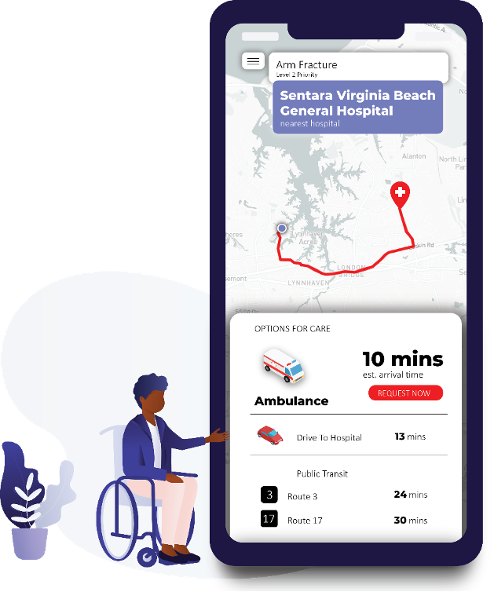

The purpose of this project is to amplify the presence of shared information in the event of a medical emergency by providing an estimated time of arrival for emergency medical services (EMS).

As today’s medical heroes work diligently to preserve lives when people are in danger, they work in imperfect urban-rural landscape in the context of larger socio-economic and environmental conditions. The emergency medical systems faces call surges, capacity overloads, and inclement weather while trying to meet the complex, diverse, and unpredictable needs of people in a life-safety crisis in the most efficient manner possible. During the COVID-19 Pandemic, first responders are reaching our for help in addressing these challenges.^[Minnesota first responders call for help guarding against COVID-19 https://www.wctrib.com/newsmd/coronavirus/6784830-Minnesota-first-responders-call-for-help-guarding-against-COVID-19]

This project develops an algorithm to predict EMS response time – the time difference between a user to calling 911 and for assistance to arrive on-scene. It uses publicly available data from the city of Virginia Beach’s Open Data Portal, EMS Calls for Service.^[https://data.vbgov.com/dataset/ems-calls-for-service]

Knowing the potential response time for an ambulance is important because it allows those in need to assess their most efficient ways of receiving care in the options that best suits the user. For example, if a user has an ankle sprain, and there’s a 11 minute estimated time of arrival for an ambulance to arrive at their location, but only 15 minutes if a user received a ride from a partner, they are now in a better position to assess the cost/benefit of calling an ambulance for that 4-minute difference.

The project proposes to use this information in a new mobile-phone application called **MyEMS**. The app allows users to select their medical emergency, visualize all the different ways they can reach care and then request an ambulance or receive driving directions to the nearest hospital. They will also be able to immediately get connected with a medical staff via telemedicine while they wait for care.

